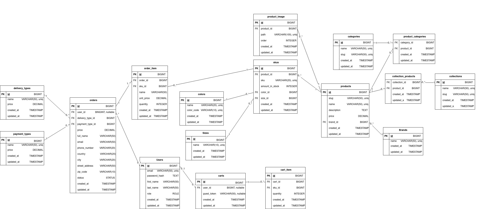
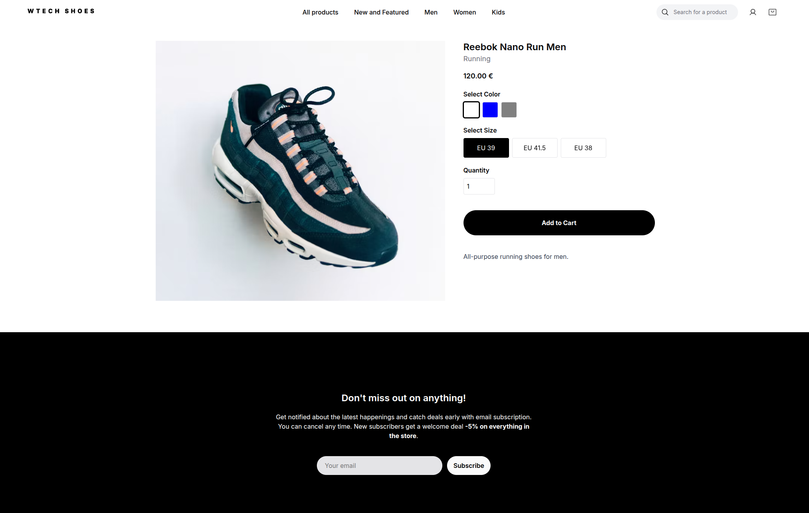
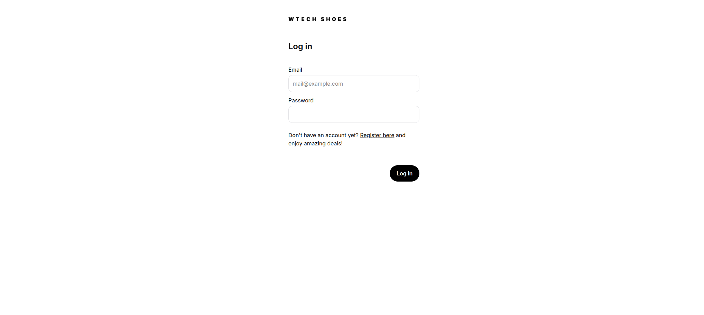
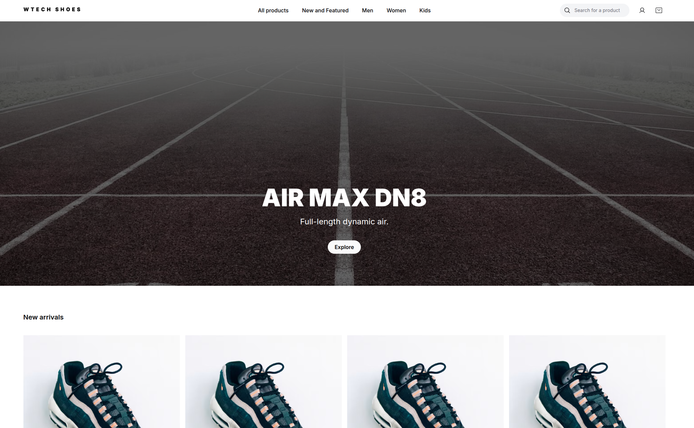
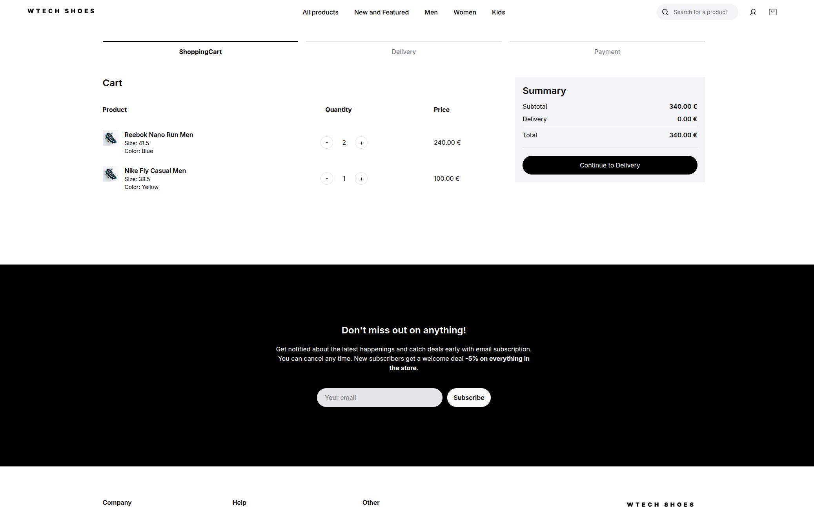

# WTECH E-Shop - Wtech Shoes

## Zadanie

Vytvorte webovú aplikáciu - eshop, ktorá komplexne rieši nižšie definované prípady použitia vo vami zvolenej doméne (napr. elektro, oblečenie, obuv, nábytok). Presný rozsah a konkretizáciu prípadov použitia si dohodnete s vašim vyučujúcim.

## Diagram fyzického dátového modelu

[](./docs/data_model.png)

- [low fidelity mockups](https://www.figma.com/design/aEwQDwwaRpp2uxGbN7WY8G/WTECH-wireframe?node-id=0-1&t=TnCMdlIpoeTeh7sg-1)

## Návrhové rozhodnutia

Použili sme **Tailwind** kvôli zjednodušeniu a zjednoteniu práce s CSS.

Produkty majú atribúty *size* a *color* a môžu patriť do viacerých kategórií.

Produkty taktiež patria do *collection* ako napríklad "Muži", "Ženy". Vďaka tomu môžeme pridávať produkty do limitovaných kolekcií, ako napríklad "Winter Sale".

## Programové prostredie

Na lokálny vývoj sme použili **Laravel Sail**. Pre databázu sme použili **Postgres** a na cache sme použili **Redis**.

## Strunčný opis implementácie vybraných prípadov použitia

### zmena množstva pre daný produkt

Pri vytvorení objednávky sa dekrementuje kvantita konkrétneho produktu (vytvorenie objdenávky a dekrementácia kvanity sa vykonáva v DB transakcii).

```php
if ($item['sku_id']) {
    SKU::findOrFail($item['sku_id'])->decrement('amount_in_stock', $item['quantity']);
}
```

Zmena množstva sa dá vykonať aj v admin rozhraní.

### prihlásenie

Na autentifikáciu sa používa `Illuminate\Support\Facades\Auth`.

Prihlásenie používateľa:

```php
$credentials = $request->only('email', 'password');
if (Auth::attempt($credentials)) {
    $this->syncSessionToDatabase();
    return redirect()->intended('/');
}
```

Pri registrácii sa najprv validujú dáta požiadavky, vytvorí sa používateľ, vytvorí sa auth session a redirectne sa.

```php
public function registerPost(Request $request)
{
    $request->validate([
        'first_name' => 'required|string|max:255',
        'last_name' => 'required|string|max:255',
        'email' => 'required|string|email|max:255|unique:users',
        'password' => 'required|string|min:8|confirmed',
    ]);

    // create user
    $user = User::create([
        'first_name' => $request->first_name,
        'last_name' => $request->last_name,
        'email' => $request->email,
        'password_hash' => Hash::make($request->password),
    ]);
    // autologin after registration
    Auth::login($user);


    $this->syncSessionToDatabase();

    return redirect('/');
}
```

### vyhľadávanie

Používateľ napíše do vyhľadávacieho poľa query a po odoslaní sa spraví redirect na `/collections?query=...`.

Produkty sa vyfiltrujú v `CollectionController` následovne:

```php
if ($query) {
    $products_query->where('products.name', 'ILIKE', '%' . $query . '%');
}
```

Využíva sa `ILIKE` v Postgres. Pre robustnejšie vyhľadávanie sa dá použiť aj napríklad Meilisearch.

### pridanie produktu do košíka

Ak používateľ ešte nemá cart v session, tak sa vytvorí. Snippet nižšie je pre guest používateľa:

```php
    $quantity = $request->quantity;
    $cart_key = 'sku_' . $request->sku_id;

    $cart = session()->get('cart', []);
    if (isset($cart[$cart_key])) {
        if ($quantity <= 0) {
            unset($cart[$cart_key]);
        } else {
            $cart[$cart_key]['quantity'] = $quantity;
        }
        session()->put('cart', $cart);
    } else {
        return redirect()->route('checkout')
            ->with('error', 'Item not found in cart.');
    }
```

Pre autentizovaného používateľa je podobná logika s tým, že cart je uložený aj v databáze.

### stránkovanie

Stránkovanie je implementované pomocou integrovaného paginátora v Eloquent ORM.

```php
$products = $products_query->paginate(12);
```

V collection view je implementované stránkovanie nasledovne:

```php
<div class="mt-10 flex justify-center items-center gap-2 flex-wrap">
    @if ($products->onFirstPage())
        <span class="px-4 py-2 bg-gray-300 text-gray-500 rounded cursor-not-allowed">First</span>
    @else
        <a href="{{ $products->url(1) }}"
            class="px-4 py-2 bg-gray-500 text-white rounded hover:bg-gray-600">First</a>
    @endif

    @php
        $currentPage = $products->currentPage();
        $lastPage = $products->lastPage();
        $range = 2;
        $start = max(1, $currentPage - $range);
        $end = min($lastPage, $currentPage + $range);

        if ($end - $start < 4) {
            if ($currentPage <= $range + 1) {
                $end = min(5, $lastPage);
            } else {
                $start = max(1, $lastPage - 4);
            }
        }
    @endphp

    @for ($i = $start; $i <= $end; $i++)
        @if ($i === $currentPage)
            <span class="px-4 py-2 bg-gray-700 text-white rounded font-bold">{{ $i }}</span>
        @else
            <a href="{{ $products->url($i) }}"
                class="px-4 py-2 bg-gray-500 text-white rounded hover:bg-gray-600">{{ $i }}</a>
        @endif
    @endfor

    @if ($products->onLastPage())
        <span class="px-4 py-2 bg-gray-300 text-gray-500 rounded cursor-not-allowed">Last</span>
    @else
        <a href="{{ $products->url($products->lastPage()) }}"
            class="px-4 py-2 bg-gray-500 text-white rounded hover:bg-gray-600">Last</a>
    @endif
</div>
```

### základné filtrovanie

Pri filtrovaní sa berú atribúty ako *brand*, *color*, *size*, *category*,... z query string-u požiadavky.

```php
$selected_category = request()->query('category');
$selected_brands = array_filter((array) request()->query('brand', []));
$selected_colors = array_filter((array) request()->query('color', []));
$selected_sizes = array_filter((array) request()->query('size', []));
$price_from = request()->query('price_from');
$price_to = request()->query('price_to');
$sort = request()->query('sort', 'top');
```

Následne sa produkty filtrujú podľa týchto atribútov. Napríklad filtrovanie podľa značiek vyzerá takto:

```php
if (!empty($selected_brands)) {
    $products_query->whereIn('brand_id', $selected_brands);
}
```

## snímky obrazoviek

### detail produktu



### prihlásenie



### homepage



### nákupný košík s vloženým produktom



## Development Setup

Instructions for setting up the development environment. **Docker** and **Docker compose** must be installed on the system.

```sh
git clone https://github.com/adam-alberty/wtech
```

```sh
docker run --rm \
    -u "$(id -u):$(id -g)" \
    -v "$(pwd):/var/www/html" \
    -w /var/www/html \
    laravelsail/php84-composer:latest \
    composer install --ignore-platform-reqs
```

```sh
./vendor/bin/sail up -d
./vendor/bin/sail npm install
./vendor/bin/sail npm run build
./vendor/bin/sail artisan migrate --seed
```

Visit `http://localhost:80`

Prístupy pre 2 testovacích používateľov: user@gmail.com a admin@gmail.com. Heslá: 12345678
